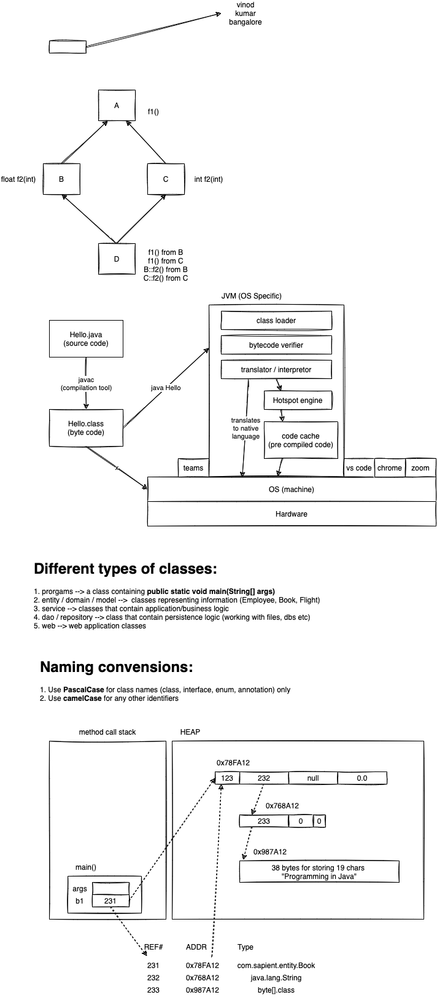

# week1/day4

## Topics for the day:

-   Java Basics
-   Classes
-   Interfaces
-   Compilers
-   JRE/JDK
-   Constructors
-   Methods
-   Packages



```

int* doStuff(){
    // int num[100] = {1, 2, 3};
    int *num = malloc(100*sizeof(int));
    printf(*num);
    num++;
    printf(*num);
    /*....*/
    return num;
}

int main() {
    int *n = doStuff();
    ...
    ...
    printf(n[0]);
    *n=123;
}

```

## Variables

1. Primitives
    - Keywords
    - Size of the variable is fixed
    - 4 categories
        1. Integers
            - byte (1 byte)
            - short (2 bytes)
            - int (4 bytes)
            - long (8 bytes)
        2. Real numbers
            - float (4 bytes)
            - double (8 bytes)
        3. Characters
            - char (2 bytes, supports UNICODE)
        4. Logical
            - boolean (1 bit, true / false)
2. References
    - Any variable which is not of a primitive type
    - Variables of class, interface, enum and annotation
    - Size of a reference variable is 4 bytes in 32 bit systems, 8 bytes in 64 bit systems

## Operators

1. Arithmetic
    - Unary
        - ++ -- + -
    - Binary
        - &plus; - \* / %
        - += -= \*= /= %=
        - =
    - Ternary
        - expr1 ? expr2 : expr3
2. Relational
    - &gt; >= < <= == !=
3. Logical
    - && ||
4. Bitwise
