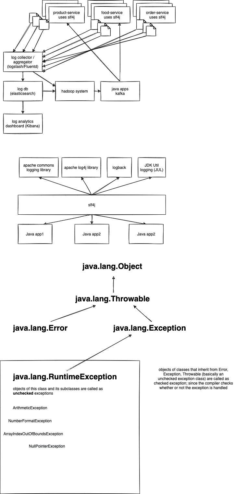

# week2/day1

## Today's topics:

-   Using Efficient Exception Handling
-   Resource Clean up Rules and Finally.
-   Custom Exception Hierarchy
-   Exception Wrapper
-   Exception Loggings

## Additional topics:

-   Logging
-   Sonarlint - code best practices
-   Arrays

