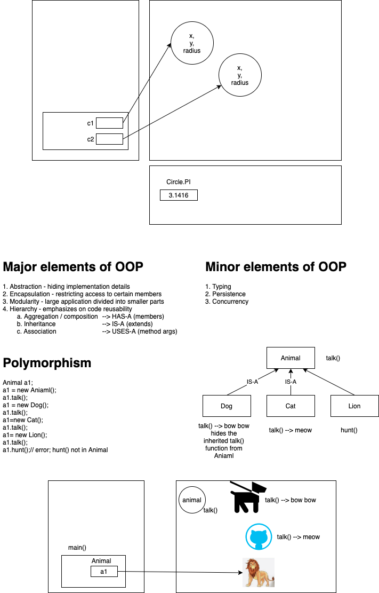

# week2/day2

## Today's topics:

-   Generics basics and implementation

## Additional topics:

-   OOP



```c++

class Animal {
    public:
        virtual void talk(){
            // ...
        }
}

class Cat: Animal {
    public:
        void talk(){
            //...
        }
}

```
