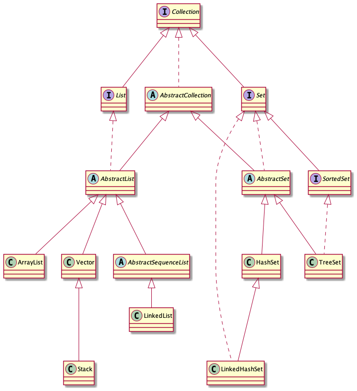
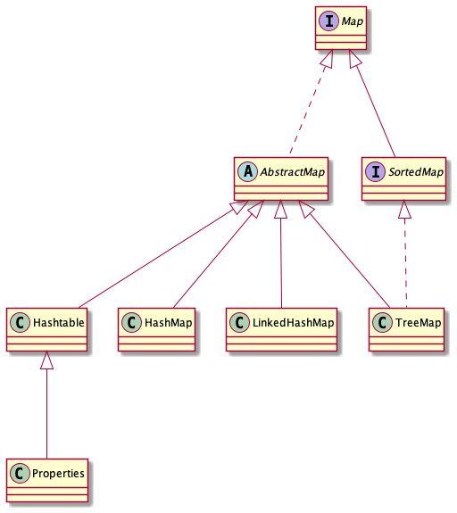
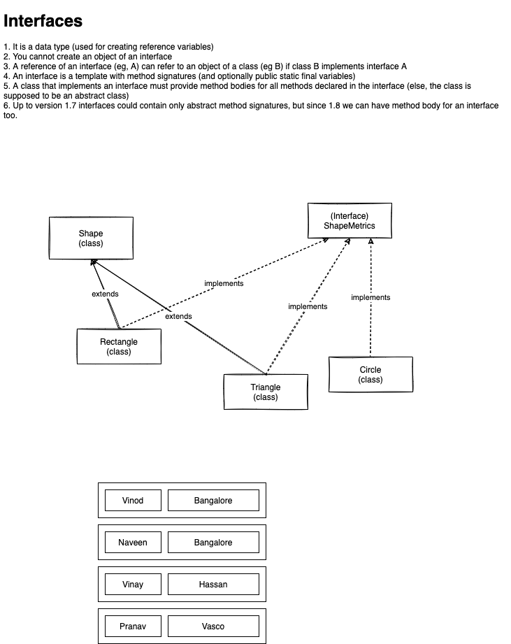

# week2/day3

## Topics for today:

-   Collection Interface
-   Set Interface
-   List Interface
-   Sorted Set Interface
-   Map Interface
-   Sorted Map Interface
-   Iterator Interface
-   List Iterator Interface
-   Collections Utility Classes add more topics to cover Collection framework in depth
-   Unmodifiable Collection
-   Thread Safety
-   Synchronized Wrappers

## Additional topics

-   Interfaces
-   Polymorphism

## Collections and Arrays - utility classes

This class consists exclusively of static methods that operate on or return
collections. It contains polymorphic algorithms that operate on
collections, "wrappers", which return a new collection backed by a
specified collection, and a few other odds and ends.

-   reverse(..)
-   shuffle(..)
-   sort(..)
-   binarySearch(..)

## Synchronized wrappers convert regulary data structure into a thread-safe data structure

-   Collection --> Collections.synchronizedCollection(coll)
-   List --> Collections.synchronizedList(list)
-   Set --> Collections.synchronizedSet(set)
-   Map --> Collections.synchronizedMap(map)
-   SortedSet --> Collections.synchronizedSortedSet(map)
-   SortedMap --> Collections.synchronizedSortedMap(map)
