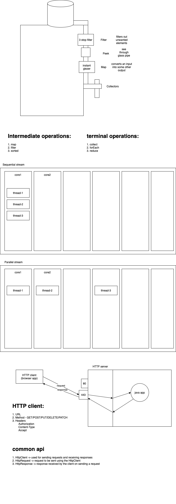

# week3/day2

## Today's topoics:

-   Introduction on Streams
    -   for Each
    -   Map
    -   Filter
    -   Sorted
    -   Collect
    -   reduce
-   Parallel Computing using Streams.
-   New String methods
-   New File Methods
-   HTTP Client in Java 11

### Streams

-   An API to process collections of data
-   an object of Stream is obtained by calling the _stream()_ method of Collection interface
- 