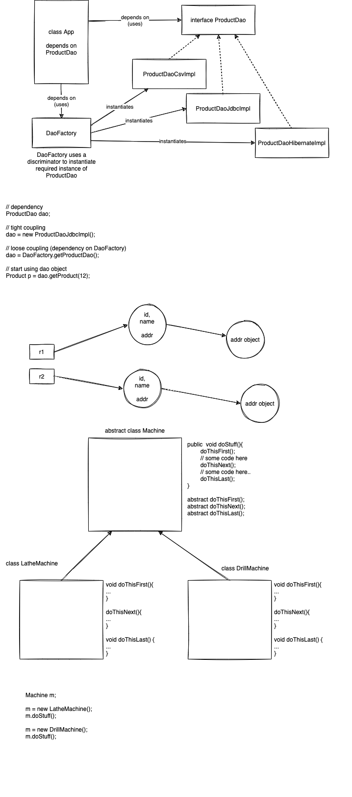

# week3/day3

## Today's topics:

-   Patterns in java for the functional Programmer
    -   Factory method pattern
    -   Template method pattern
    -   Builder pattern
    -   Singleton
    -   Chain of responsibility pattern - self study
    -   Command Pattern - self study
-   Functional Programming Design principles
    -   Pure functions and no side effects/disciplined states - reliable values
    -   Immutability
    -   Disciplined state
    -   Referential transparency
    -   functions as First class objects
        -   can be passed as method params
        -   can be returned from functions
        -   can be assigned to variables
    -   High order functions
        -   A function that takes another function as parameter
        -   A function that returns another function as return value
        -   Collections.sort(names, (n1, n2) -> n2.compareTo(n1));
    -   Type systems
        -   Java is a statically / strongly typed language
        -   Variables get tightly associated with their datatypes
        -   Once delcared, type cannot be changed



```java

JsonBuilder jb = new JsonBuilder();


jb.build(); // should return String version of JSON


```

Circle.java

```java

public class Circle {
    // object data
    private double radius;

    // class data
    private static final double PI = 3.1416;


    public void setRadius(double radius){
        this.radius = radius;
    }
    public double getRadius(){
        return this.radius;
    }
    public double getArea() {
        return Math.PI * radius * radius;
    }

    public void printPiValue() {
        System.out.println("PI = " + PI);
    }


}

```

## References:

1. https://kelutral.com/design-patterns-in-object-oriented-programming
1. https://careerkarma.com/blog/functional-programming-languages/
1. https://www.baeldung.com/java-functional-programming
1. https://sourcemaking.com/design_patterns
1. search your text in google with "geeksforgeeks"
    1. for example: "functional programming" + "geeksforgeeks"
