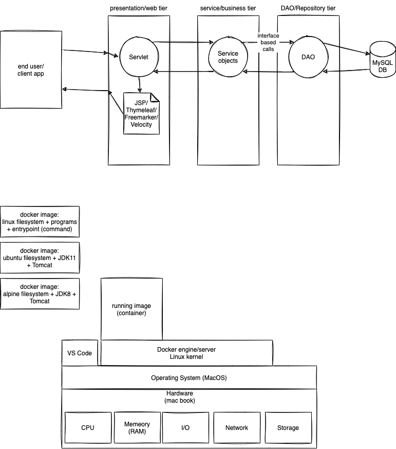

# week3/day5

## Today's topics:

-   Mocks, Stubs,
-   Using Mock Effectively
-   Test Suites
-   Test Data and Best Practices
-   Code smells and refactoring - Sonarqube or Sonarlint
-   Metrics and Code Coverage and Unit Testing - JaCoCo
-   Tooling Support
-   api Virtualization v/s mocking

## Additional topics:

-   Setup Docker
-   Docker basic terminologies

## Pending topics:

-   Executor API
-   Callable/Future/Completable



```javascript
it('should add two numbers', () => {
    let expected = 46;
    let actual = calc.add('12, 34');
    assertEquals(expected, actual);
});
```

### Use case for mock - fund transfer from one account to another

```java

public class AccountService {

    // depedency
    private AccountDao dao; // interface variable

    public AccountService(){
    }

    // dependency injection using constructor
    public AccountService(AccountDao dao){
        this.dao = dao;
    }

    // dependency injection using setter
    public void setAccountDao(AccountDao dao){
        this.dao = dao;
    }

    public void transferFunds(String fromAcNo, String toAcNo, double amount) throws ServiceException {
        Account from = dao.getAccount(fromAcNo);
        Account to = dao.getAccount(toAcNo);
        from.setBalance(from.getBalance() - amount);
        from.setBalance(from.getBalance() - 5.0); // service charge
        to.setBalance(to.getBalance() + amount);
        dao.updateAccount(from);
        dao.updateAccount(to);
    }

}

```

### Docker command to start sonarqube server

```sh

docker run --name=sonar-server -p 9000:9000 -d sonarqube

```

## ExecutorService

-   allows execution of asynchronous tasks
-   provides a pool of threads and api for assigning tasks (runnable, callable)
-   we do not create threads, but use the ones provided by ExecutorService

Important API:

-   ExecutorService
-   Runnable
-   Callable
-   Future
-   Executors (utility class for creating ExecutorService instances)

CompletableFuture is a class that implements Future and provides asynchronous programming. We can continue to execut a piece code, with out blocking when we call .get() method.

## References:

-   https://www.baeldung.com/java-executor-service-tutorial
