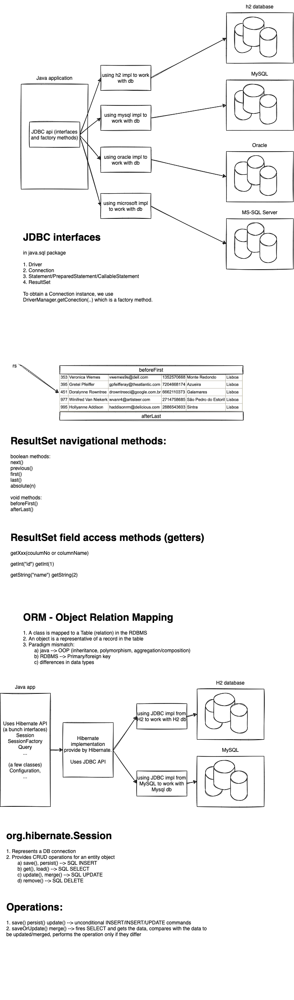

# week4/day1

## Today's topics:

-   JDBC Architecture
-   Connection
-   Statement, PreparedStatement & CallableStatement
-   ResultSet
-   Difficulties in JDBC
-   Overview of ORM
-   Hibernate basics
-   Hibernate setup
-   CRUD operations



## Self learning

-   Statment is prone for SQL injection attacks
-   find out about SQL injection


```java
    String state = "Karnataka";
    String sql = "select * from customers where state = '" + state + "'";
    // select * from customers where state = 'Karnataka';
    // state = "' or 1=1 --"
    // select * from customers where state = '' or 1=1 --'

    sql = "select * from users where email='" + email + "' and password='" + password + "'";
    // email = "' or 1=1 --";
    // password = "";
    // select * from users where email='' or 1=1 --' and password=''
```