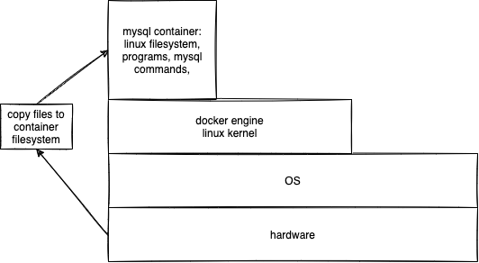

# week4/day2

## Topics for the day:

## Some docker commands:

-   To create and run a mysql server using docker:
    

```sh
    docker run -d --name mysql-server -p 3306:3306 -v mysql_data:/var/lib/mysql -e MYSQL_ROOT_PASSWORD=Welcome#123 mysql
```

-   to execute a command on the running container (in this case, mysql-server)

```sh
    docker exec -it mysql-server <command> <command parameters>
    docker exec -it mysql-server mysql -uroot -pWelcome#123 trainingdb
    docker exec -it mysql-server sh
```
