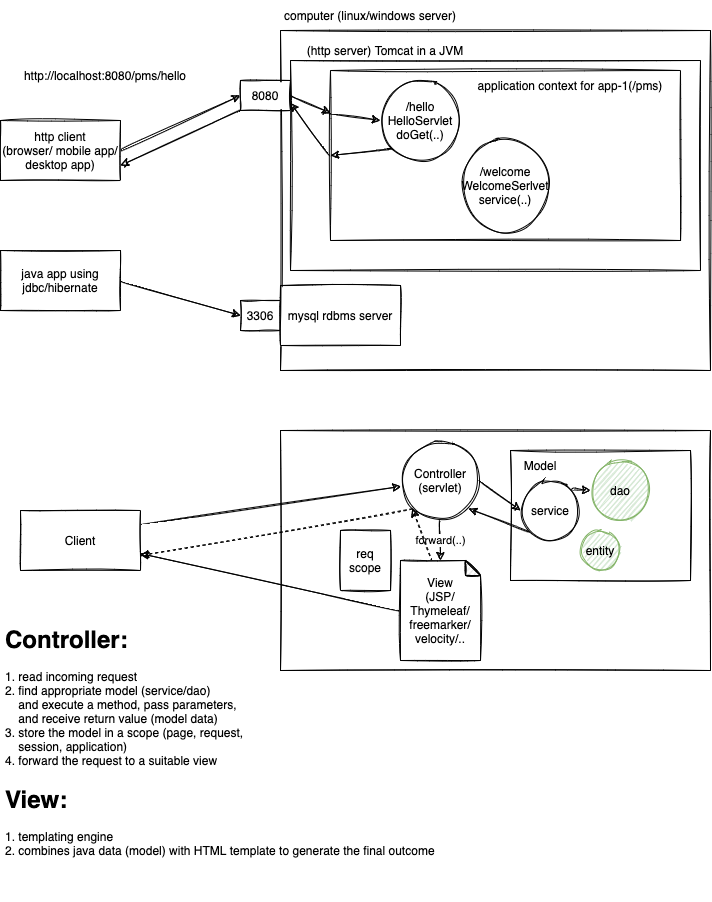
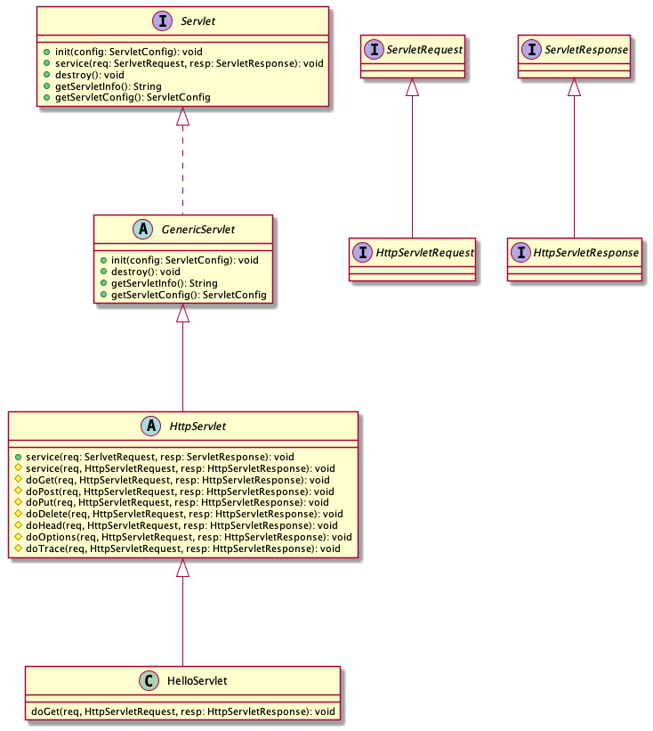

# week4/day3

## Topcis for the day:

-   Web basics
-   Understanding HTTP protocol (RFC2616)
-   Java Servlet API
-   Handling HTTP requests
-   JavaServer Pages
-   MVC pattern

## Topics from Week 1 day 2:

-   Configure Tomcat in eclipse
-   Web projects and eclipse settings
-   Create a Maven web Project in Eclipse

## Udemy link for "Develop Java MVC web apps using MyBatis, Servlets and JSP"

https://www.udemy.com/course/develop-java-mvc-web-apps-using-mybatis-servlets-and-jsp/?couponCode=2893EBA51DE011F80CF3

---





Tomcat (or any JEE web container) is obligated to call the service function defined in the servlet interface:

```java
public abstract void service(ServletRequest req, ServletResponse resp) throws IOException, ServletException;
```

However, when you write a class that inherits from HttpServlet, following methods are available:

```java
public void service(ServletRequest req, ServletResponse resp) throws IOException, ServletException {...} // 1
protected void service(HttpServletRequest req, HttpServletResponse resp) throws IOException, ServletException {...} // 2
protected void doGet(HttpServletRequest req, HttpServletResponse resp) throws IOException, ServletException {...}
protected void doPost(HttpServletRequest req, HttpServletResponse resp) throws IOException, ServletException {...}
protected void doPut(HttpServletRequest req, HttpServletResponse resp) throws IOException, ServletException {...}
protected void doDelete(HttpServletRequest req, HttpServletResponse resp) throws IOException, ServletException {...}
protected void doHead(HttpServletRequest req, HttpServletResponse resp) throws IOException, ServletException {...}
protected void doOptions(HttpServletRequest req, HttpServletResponse resp) throws IOException, ServletException {...}
protected void doTrace(HttpServletRequest req, HttpServletResponse resp) throws IOException, ServletException {...}
```

When a request is received by Tomcat for your servlet, Tomcat always invokes the service(1) method, which invokes the protected service (2) method, by converting the parameters into their HTTP variants. This service method, checks the HTTP request method from the client, and accordingly calls the doXxx method. Since such a method is overridden in our servlet class, our doXxx method will be invoked.

```java

for(Product p: products) {

}

```
