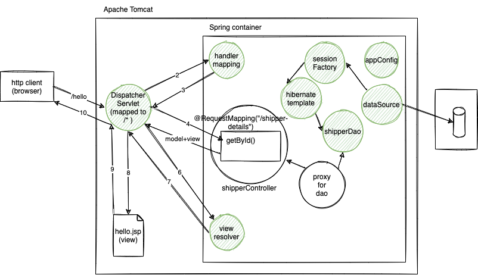

# week4/day5

## Toics of the day:

-   Spring MVC architecture
-   DispatcherServlet
-   HandlerMapping
-   Controllers and request handlers
-   ViewResolver
-   Handling GET and POST requests

### Assignment:

1. Convert the Day 7 assignment into a web application using Spring MVC and HibernateTemplate.
