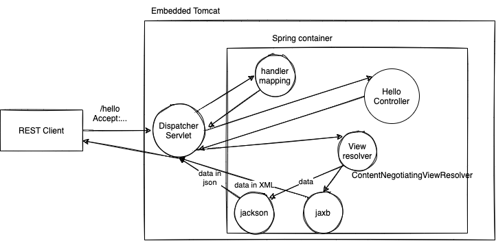

# week5/day1

## Toics of the day:

-   Spring boot - what, why and how
-   Creating REST endpoints
-   Best practices to be followed

## ReST - Representational State Transfer

-   Transferring (exchange of) state (information) in different representations (formats like JSON or XML)
-   Client and server exchange informatio in different formats (most likely JSON in today's world)
-   Clients here are frontend applications (Angular, Reactjs, Vuejs or mobile apps)
-   Always clients intiates requests, and servers respond with data
-   Http protocol provides verbs - POST, GET, PUT, DELETE, which can be used for making a request
-   These in turn trigger, CREATE, READ, UPDATE AND DELETE operations on the server side
-   The service as a whole is considered to be RESTful if it follows the constraints listed by Roy Fielding
    -   Uniform Interface (use URI for representing a resource, for example, /products /employees /employees/12 /employees/12/manager)
    -   Stateless (Client has to identify themselves on each request. Server doesn't have to remember the clients)
    -   Client-Server
    -   Layered System
    -   Cacheable
    -   Code on Demand
-   Client can do content negotiation with the server
    -   **Accept** http header is used for asking a specific representation from the server
    -   **Content-Type** header is used by the client to send a particular type of representation to the server
-   A resource is a bunch of data (state) and hence the URI to represent the resource is generally PLURAL (e.g, /products instead of /product)

## Best practices

1. ReST API must accept and respond with JSON representation
1. Never use verbs in URLs

    - incorrect urls:
    - http://example.com/api/get-books
    - http://example.com/api/add-new-book
    - correct urls:
    - GET /api/books
    - GET /api/books/12
    - POST /api/books

1. Always use **plurals** and **nouns** for resource names
1. Use resource nesting

    - GET /api/books
    - GET /api/books/12
    - GET /api/books/12/authors
    - GET /api/books/12/authors/3
    - GET /api/books/12/authors/3/books
    - GET /api/orders
    - GET /api/orders/10248
    - GET /api/orders/10248/employee
    - GET /api/orders/10248/employee/manager
    - GET /api/orders/10248/customer
    - GET /api/orders/10248/customer/orders

1. Respond with JSON error details in the response body, if/when encountered with error
1. Document your APIs
    - Swagger UI is the best for API documentation
1. Use proper status codes for responses

## Assignments:

-   Create a REST endpoint to expose implementation of the DAO interface of Day 7 assignment.
