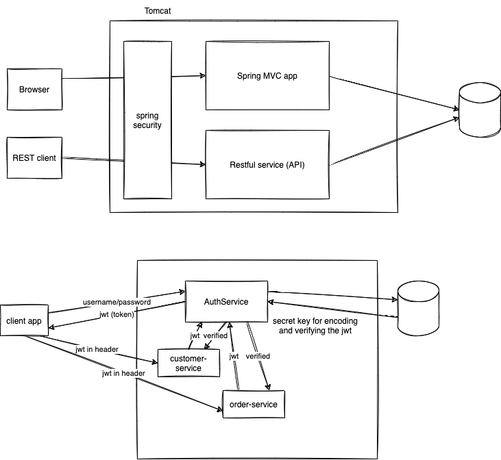

# week5/day3

## Topics for the day:

-   Authentication and Authorization
-   Programmatic v Declarative Security
-   Getting Spring Security from Maven
-   Spring Security Configuration
-   Spring Security Configuration Example with JWT
-   Oauth Concepts and Basics



```sql

create table USERS(
    email varchar(200) primary key,
    password varchar(255) not null,
    is_active boolean default true
);

insert into USERS(email, password) values 
('vinod@vinod.co', '$2a$12$bt17fwm34EecEPy9eQyc1.zX6ro4nDax8ArlChOfetdshj3uRLOdm'), 
('shyam@xmpl.com', '$2a$12$q2h/GAhVfXh6R5D.jXMV3.pighc4bTujuU258C4VGj1ZyCvLM/pNC'), 
('johndoe@xmpl.com', '$2a$12$1B5gEl6qOa6fRL3YHlVCtOQbK45Lbu.F7mi7dRgMaSNhowKbXpOpG'); 
-- topsecret
-- shyam@123
-- johndoe@123

insert into USERS values ('janedoe@xmpl.com', '$2a$12$Td9p59S4MNXdD8lQO5oweeT3MHP/eWZac00f7wZf9rwvYYswJbXa.', false); -- janedoe@123

create table USER_ROLES (
    email varchar(200) not null,
    role varchar(50) not null,
    constraint unq_email_role unique(email, role),
    constraint fk_email foreign key (email) references USERS(email)
);

insert into USER_ROLES values
('vinod@vinod.co', 'ROLE_ADMIN'),
('vinod@vinod.co', 'ROLE_USER'),
('shyam@xmpl.com', 'ROLE_ADMIN'),
('shyam@xmpl.com', 'ROLE_USER'),
('johndoe@xmpl.com', 'ROLE_USER'),
('janedoe@xmpl.com', 'ROLE_ADMIN');

```
