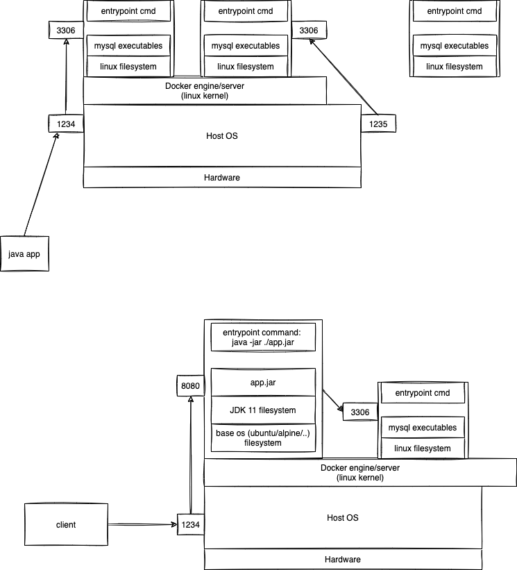

# week5/day4

## Topcis for today:

-   Docker setup
-   Images and containers
-   Containerising a Maven Java project
-   Integrating with Jenkins

### Different ways to run a spring boot service

1. By using the spring-boot plugin
    - `mvn spring-boot:run`
2. By running a java archive
    - mvn clean package -DskipTests
    - java -jar target/JAR_FILE_NAME

To create an image:

-   `docker build -t shipper-service:latest .`

To run the container with connection to the MySQL server

-   `docker run -d -p 1234:8080 --name shipper-service -e MYSQL_PASSWORD=root -e MYSQL_HOST=mysql-server --link mysql-server shipper-service:latest`

## Assignments:

-   Write short notes about all the docker commands learnt today
-   Containerize all the applications created in the previous sessions
-   Publish all the images created in the above task
-   Create 3 to 4 different containers and explore the working of docker networking
