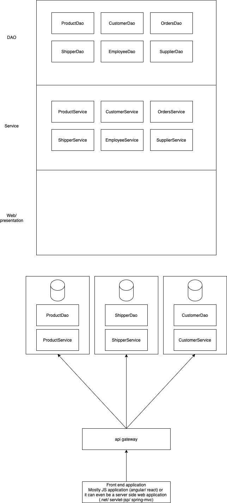
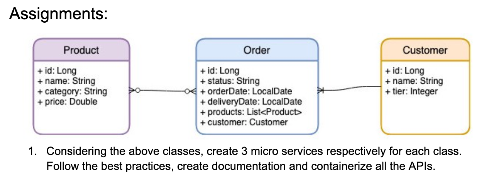

# week5/day5

## Today's topics:

-   Traditional Monolithic Designs and Their Role
-   Disadvantages of Monoliths
-   Moving from a Legacy Monolith
-   When Moving from a Legacy Monolith
-   The Driving Forces Behind Microservices
-   How Can Microservices Help You?
-   The Microservices Architecture
-   Utility Microservices at AWS
-   Microservices Inter-connectivity
-   The Data Exchange Interoperability Consideration
-   Managing Microservices

## Positive side of monolith apps

-   less cross cutting concerns
-   easy to debug and testing
-   easy to deploy

## negative side of monolith apps

-   for a new developer, understanding the entire architecture is a difficult taks
-   scaling individual modules
-   new tech barriers

## Advantages of Micro services

-   component independence
-   since the keyword here is **micro**, it is easier for a new developer to understand the given service
-   scalable
-   agility
-   easy/fast development
-   tech freedom

## Disadvantage of micro services

-   At an application level, the architecture is a bit difficult for understanding
-   cross cutting concerns

## Utility Microservices at AWS

-   Compute
    -   Containers (ECR, ECS)
    -   EC2
    -   Serverless (AWS Lambda)
-   Storage
    -   Cache (ElasticCache)
    -   S3
    -   NoSQL db (DynamoDB)
    -   RDBMS (RDS, Aurora)
-   Logging/monitoring
    -   CloudWatch
    -   CloudTrall
    -   X-Ray

## Micro services inter-connectivity

In Spring boot:

-   Spring RestTemplate
-   Spring WebClient

## The Data Exchange Interoperability Consideration

-   JSON is the preferred format for data exchange
-   XML was used in the past
-   Ohter formats (CSV, YAML)

## Managing Microservices

-   Docker Compose (for local container management)
-   Container Orchestration
    -   Docker swarm
    -   K8S
        -   Allows automation of container (micro service) management
        -   Automatic scaling
        -   Security

# Docker compose commands:

-   docker compose up
-   docker compose up -d
-   docker compose down
-   docker compose ps

