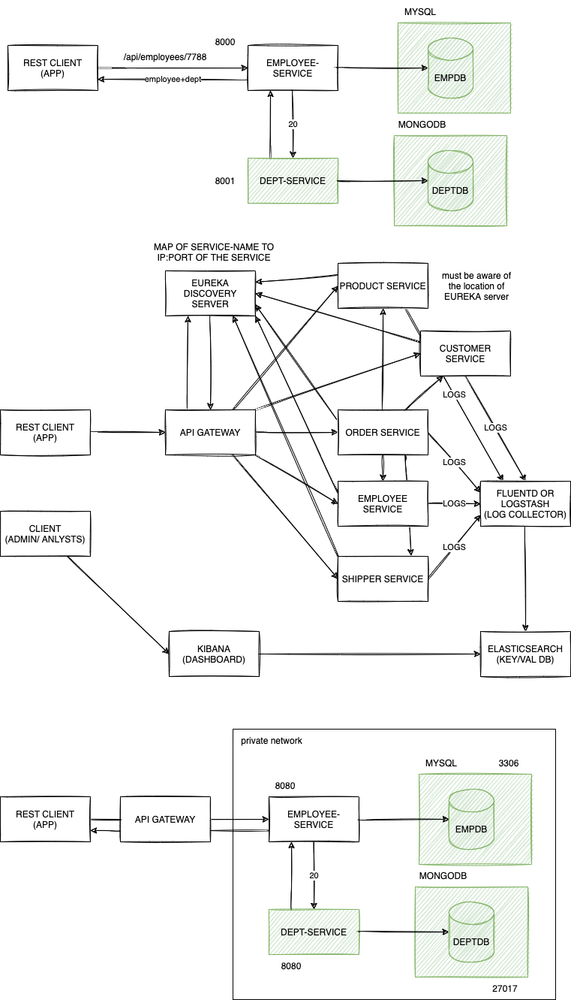

# week6/day1

## Today's topics:

-   Implementing Microservices
-   Embedding Databases in Java
-   Microservice-Oriented Application Frameworks and Platforms
-   Design Patterns
    -   Aggregator pattern (makemytrip.com, bookmyshow.com, airbnb.com)
    -   API Gateway pattern
    -   Chain of responsibility (chained)
    -   Shared data (database) pattern
    -   Asynchronous messaging / request pattern

