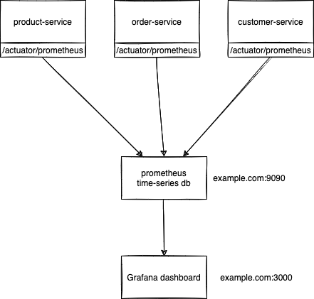

# week6/day2

## Topics for the day:

-   Embedding Databases in Java
-   Troubleshooting
-   Load and CPU Usage
-   Basics of Thread dumps
-   Heap and other metrics
-   Log and Log file understanding
-   Connection and Network Troubleshooting Basics
-   Instrumentations, Micrometer and JMX Basics
-   Monitoring Java applications
-   Checklist on trouble shooting

