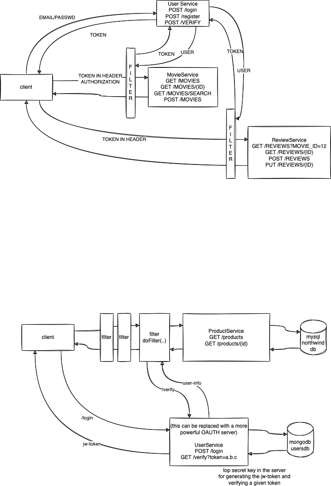

# Week 6 Day 4



Data in Mongodb database (usersdb), collection users -

db.users.find()

```js
[
    {
        _id: 1,
        name: 'Vinod',
        email: 'vinod@vinod.co',
        password: 'topsecret',
    },
    {
        _id: 2,
        name: 'Shyam',
        email: 'shyam@xmpl.com',
        password: 'topsecret',
    },
];
```
